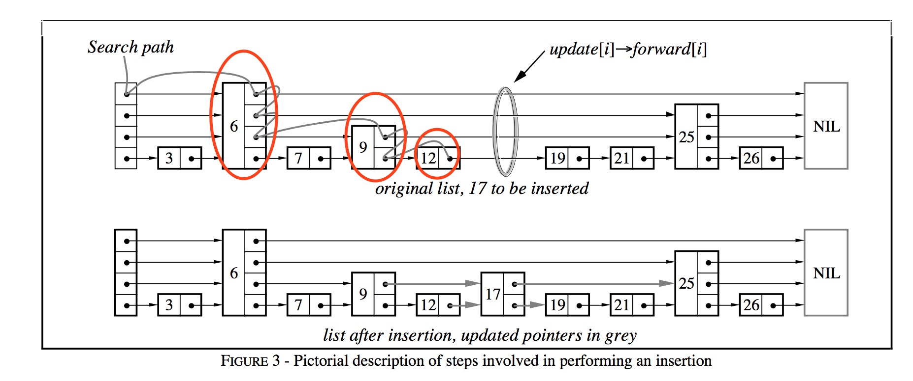

首先学习`LevelDB`当中比较独立的一部分，当然的，读源码的话，一个很好的入门的感觉就是先从一个独立的组件模块开始，一个比较容易的开始，`SkipList`

然后跳表的基本概念什么的我不太想要去过多的赘述，就像二叉树那样希望能得到`log(N)`的性能，而又利用概率算法更好实现

## 读写特性

在`LevelDB`的实现中，主要就是实现
+ `PUT`和`GET`两个接口
+ 特性是它的**GET 操作非阻塞的特性**，实现乐观的读写冲突
+ 写写冲突是需要external sync来实现，在一个时间下只有一个写可以执行来实现线程安全的机制

这样为了实现读写冲突不加锁的性质，主要实现的思想就是
+ 首先在跳表的不同层高中插入节点这一个操作是原子的
+ 插入的顺序是从最底层开始向上传递的

这样可以实现在GET操作中，即使在GET上方没有能找到对应的节点，但是它会向下走，到最后一层就一定会看见，即使中间没有看见

## 实现细节

在实现上就是有一个虚拟头节点`Node* const head_;` 这个节点拥有最高的层高，然后本身节点是NULL，然后为了保证"跳表的不同层高中插入节点这一个操作是原子的", 对`Struct Node`的实现中`std::atomic<Node*> next_[1];`存储next的指针是`atomic`的类型，对其读写使用`std::memory_order_acquire, std::memory_order_release`来实现原子性和防止重排序

然后，我不指望说我能完全说会它的实现，然后每一个细节都不放过，没有，重点是理解跳表是如何实现它的乐观读写特性，以及实现上对`atomic`和`std::memory_order_acquire, std::memory_order_release`的使用

tips: 哦，对了，这个跳表并不支持删除，所谓的删除它还是使用Put然后插入一个空值，还没有严谨地理解这个