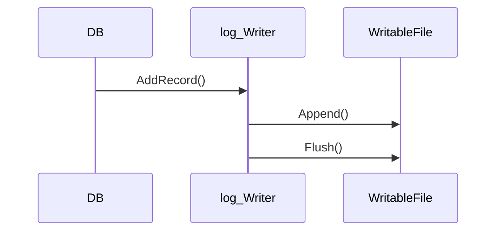
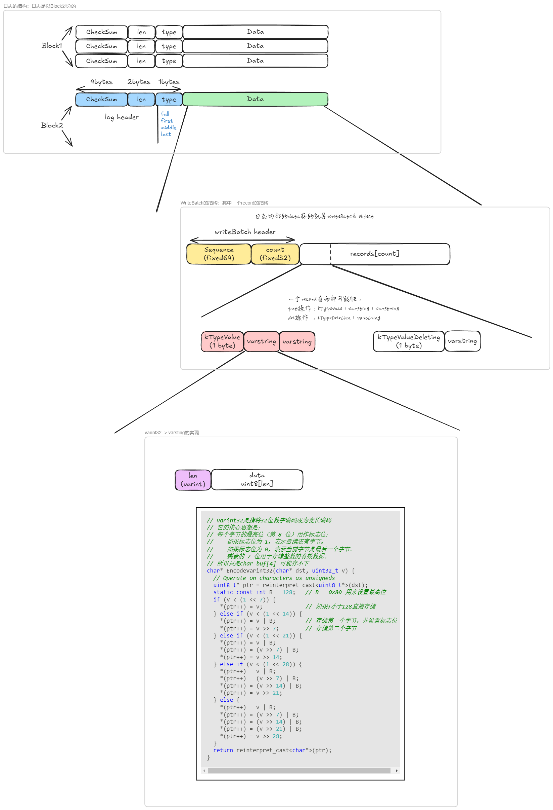

在这样的情况之下，我就想来捋一下，这个代码的逻辑

首先从不同的模块说起吧
+ `include/leveldb` : 这里面存储了要暴露给外部的API，这里面的结构，从使用者来说会比较熟悉，就是通过这里面的结构，实现它的功能，对不同的组件会有一个直观的定义
+ `db` : 这里面是对应的实现的类，不仅实现了`include/leveldb`内部，并且还有很多大量相关的部分，但是没有被暴露的部分，从`include`入手有一个直观印象再慢慢深入`db`中相关的实现
+ `util` : 这个是相关的工具包，更通用，对以上的支持功能

然后我希望的是一种从上到下的解释吧

## Include 接口

**`option.h`** 是对需要进行的操作，比如说 put或者delete 操作的的定义，在这里，我就只有一个 `bool sync` 指定这个操作是否是需要同步刷入磁盘中

**`slice.h`** 这个就是数据视图，就只有对应数据的指针和size
+ 为什么不直接用String? 
  + 因为使用String进行传播，会出现多次的复制，降低性能
+ 减少复制为什么不使用`&`引用传递? 
  + 因为引用传递并不能只指向String的一部分，而slice可以使用`char* data_`指向不同的地址和size_就可以灵活的指向数据的一部分
+ 因此slice因为其灵活性广泛被使用，尤其在需要被不同组件传递的数据中

```cpp
Slice() : data_(""), size_(0) {}

private:
    const char* data_;
    size_t size_;
```

**`status.h`** 是一个非常常见的返回状态的类，返回状态不要只是使用bool值表示，使用包装类可以保存更多信息

*---以上我觉得是比较灵活的接口小的设计，为了更好的使用，下面这两个部分，就涉及到了程序的核心组件---*

**`db.h`** 数据库的基类，主要使用name命名数据库，定义`Put, Delet, Write, Get`方法

**`write_batch.h`** 是一个非常非常重要的类，里面保持了所有要做的操作，它的编码很重要，日志中也会保存


## WAL 实现

在这里面就是具体的实现部分，然后每个组件和每个组件之间的联系，内部的成员变量，然后这里的话，我并不想再赘述什么操作的实现逻辑，机制什么的，可以参考 [leveldb handbook](https://leveldb-handbook.readthedocs.io/zh/latest/memorydb.html) 写的很好，也很简洁，是我非常喜欢的风格。

然后我主要是想捋一下 db, log, file 这部分的逻辑



+ 这里就是DB中会有一个`log::Writer`对象，DB会将对应要写入的`WriteBatch`通过`AddRecord()`方法传入
+ 在`log::Writer` 主要负责得到了对应要写的操作，然后编码成为log的结构，然后把对应的数据传递给`WritableFile`对象
+ `Writeable`对象就是对应的file的管理，它就是对文件读写的封装，实现的就是被对应的内容调用`write()`系统调用写进文件

然后我的理解就是
+ `DB`: 接受用户的操作信息
+ `log::Writer`: 得到用户操作信息然后将其保证编码成为一个log的结构
+ `WritableFile`: 就是单纯的`write()`系统调用的包装，有对应应用层的缓存

tips：`log::Writer`不太理解，就是它的`int block_offset_`不知道是如何用的，应该是在read部分会有帮助吧？

## WriteBatch和log的结构



## fixed64，fiex32的编码

除了在日志中`varint`的编码，在编码上，对于数字，也有特别的注意，因为它是以小端存储，在encode的时候也要以小端的方式，但是对应char部分是不用的，只是对于数字是需要额外编码的，因为char是没有歧义的，每个字节每个自己的存的，但是数组不是只一个字节，还需要关注字节之间的顺序，主要是在`coding.h`中

```cpp
inline void EncodeFixed32(char* dst, uint32_t value) {
  uint8_t* const buffer = reinterpret_cast<uint8_t*>(dst);

  buffer[0] = static_cast<uint8_t>(value);        // 存储最低字节 0x78
  buffer[1] = static_cast<uint8_t>(value >> 8);   // 存储次低字节 0x56
  buffer[2] = static_cast<uint8_t>(value >> 16);  // 存储次高字节 0x34
  buffer[3] = static_cast<uint8_t>(value >> 24);  // 存储最高字节 0x12
}

inline uint32_t DecodeFixed32(const char* ptr) {
  const uint8_t* const buffer = reinterpret_cast<const uint8_t*>(ptr);

  return (static_cast<uint32_t>(buffer[0])) |
         (static_cast<uint32_t>(buffer[1]) << 8) |
         (static_cast<uint32_t>(buffer[2]) << 16) |
         (static_cast<uint32_t>(buffer[3]) << 24); 
}

inline uint64_t DecodeFixed64(const char* ptr) {
  const uint8_t* const buffer = reinterpret_cast<const uint8_t*>(ptr);

  return (static_cast<uint64_t>(buffer[0])) |
         (static_cast<uint64_t>(buffer[1]) << 8) |
         (static_cast<uint64_t>(buffer[2]) << 16) |
         (static_cast<uint64_t>(buffer[3]) << 24) |
         (static_cast<uint64_t>(buffer[4]) << 32) |
         (static_cast<uint64_t>(buffer[5]) << 40) |
         (static_cast<uint64_t>(buffer[6]) << 48) |
         (static_cast<uint64_t>(buffer[7]) << 56);
}

inline void EncodeFixed64(char* dst, uint64_t value) {
  uint8_t* const buffer = reinterpret_cast<uint8_t*>(dst);

  buffer[0] = static_cast<uint8_t>(value);        
  buffer[1] = static_cast<uint8_t>(value >> 8);   
  buffer[2] = static_cast<uint8_t>(value >> 16);  
  buffer[3] = static_cast<uint8_t>(value >> 24);  
  buffer[4] = static_cast<uint8_t>(value >> 32);  
  buffer[5] = static_cast<uint8_t>(value >> 40);  
  buffer[6] = static_cast<uint8_t>(value >> 48);  
  buffer[7] = static_cast<uint8_t>(value >> 56);  
}
```

